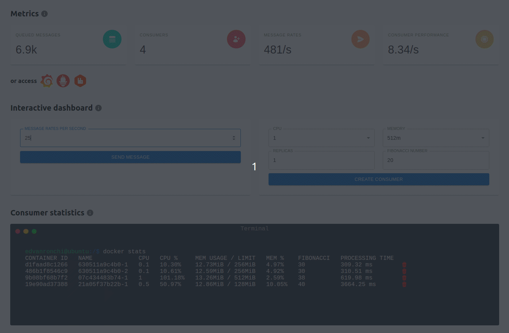
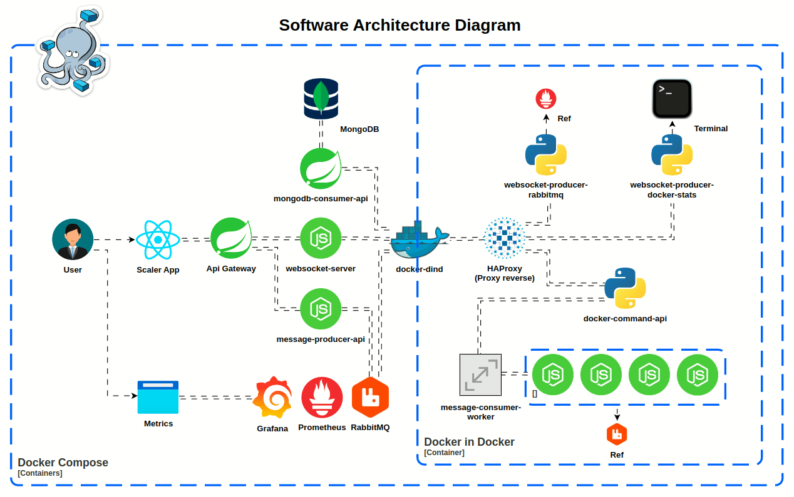

# Escalabilidade, Observabilidade e Processamento

## 1. Introdução

### 1.1 Visão Geral
O projeto oferece ferramentas abrangentes para gerenciar de maneira eficiente o envio e recebimento de mensagens em um sistema de mensageria. Possui a capacidade de ajuste dinâmico de consumers para lidar com diversas cargas de trabalho, permitindo a adição de configurações de hardware específicas para os consumers. Além disso, possibilita a visualização detalhada da aplicação e do processamento, assegurando um monitoramento contínuo.



### 1.2 Objetivos
- Observar o comportamento individual de cada consumidor por meio de suas configurações específicas
- Trabalhar de forma eficaz com microsserviços
- Utilizar um sistema de mensageria eficiente
- Implementar monitoramento e observabilidade
- Adotar o uso de containers Docker para maior simplicidade e portabilidade

## 2. Arquitetura

### 2.1 Tecnologias e Ferramentas Utilizadas
A seguir, algumas das principais tecnologias e ferramentas empregadas no projeto:

- Docker
- Grafana
- HAProxy (Proxy reverso)
- Java (Spring Boot)
- MongoDB
- Node.js (Express)
- Python (Flask, Asyncio)
- RabbitMQ
- ReactJS
- Socket.io
- Prometheus

### 2.2 Microsserviços
Um resumo das funções atendidas por cada aplicação.

- [docker-dind](docker-dind/README.md)
  - [docker-command-api](docker-dind/docker-command-api/README.md)
  - [message-consumer-worker](docker-dind/message-consumer-worker/README.md)
  - [websocket-producer-docker-stats](docker-dind/websocket-producer-docker-stats/README.md)
  - [websocket-producer-rabbitmq](docker-dind/websocket-producer-rabbitmq/README.md)
- [gateway-api](gateway-api/README.md)
- [message-producer-api](message-producer-api/README.md)
- [mongodb-consumer-api](mongodb-consumer-api/README.md)
- [scaler-app](scaler-app/README.md)
- [websocket-server](websocket-server/README.md)

### 2.3 Diagrama de Arquitetura



## 3. Instalação

### 3.1 Pré-requisitos
Certifique-se de que o Docker está instalado e funcionando corretamente em seu sistema.

### 3.2 Instruções de Instalação
Execute o seguinte comando para criar e iniciar os contêineres necessários:
```sh
docker-compose up --build -d
docker exec -d docker-dind sh -c "sh start.sh"
```

## 4 Desafios durante o desenvolvimento

### 4.1 Comunicação dos consumers com outros serviços
Os consumers são containers que operam dentro de outro container (docker-dind). A única solução encontrada consistiu em utilizar o container principal (docker-dind) para facilitar a comunicação com outros serviços, como o RabbitMQ. Optou-se pelo uso do endereço padrão 172.17.0.1 para estabelecer a comunicação com o container principal. Em seguida, implementou-se o [HAProxy](docker-dind/haproxy/haproxy.cfg) para realizar o redirecionamento apropriado para cada serviço, conforme a porta especificada.

### 4.2 Inicialização do serviço docker-dind em conjunto com outras aplicações  
Para que o projeto funcione, além de iniciar o docker-dind, é preciso iniciar outras aplicações dentro dele, como o docker-command-api, que cria os consumers. Ao tentar iniciar esses processos simultaneamente, o docker-dind não conseguia criar os containers, pois as aplicações paralelas impediam o início do docker. Depois de várias tentativas, foi criado um arquivo chamado [start.sh](docker-dind/start.sh), que executa todas as aplicações necessárias, garantindo assim o funcionamento correto.

## 5 Roadmap

### 5.1 Fases Concluídas
- [x] Iniciar o Projeto
- [x] Desenvolver o Protótipo da Interface
- [x] Elaborar o Diagrama de Arquitetura
- [x] Estabelecer o API Gateway
- [x] Implementar Producers e Consumers para o RabbitMQ
- [x] Incorporar Funcionalidades de Monitoramento e Observabilidade
- [x] Apresentar Informações em Tempo Real através de WebSocket
- [x] Documentar a API

### 5.2 Próximas Etapas
- [ ] Implementar Sistema de Autenticação
- [ ] Otimizar o Processo de Criação da Imagem Docker
- [ ] Implementar Monitoramento de Logs
- [ ] Adicionar Variáveis de Ambiente Para Teste e Produção
- [ ] Realizar o Deploy do Projeto